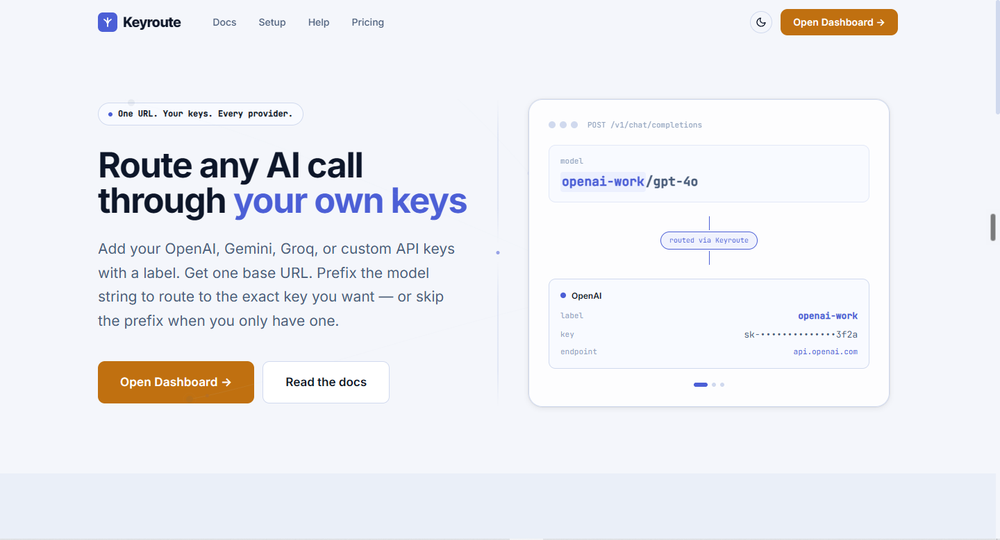
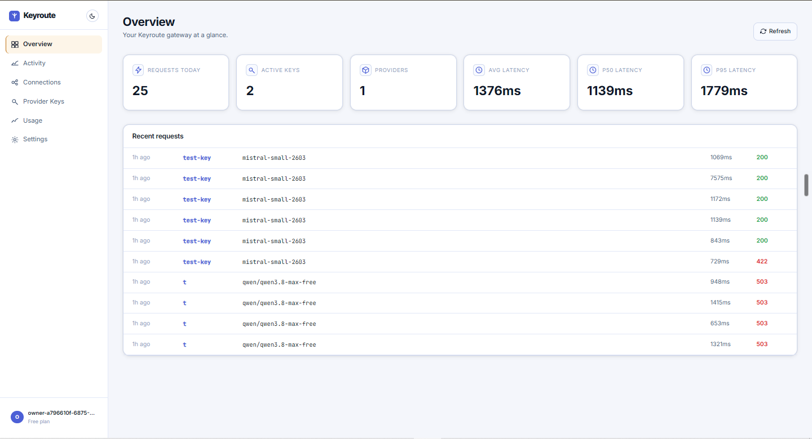
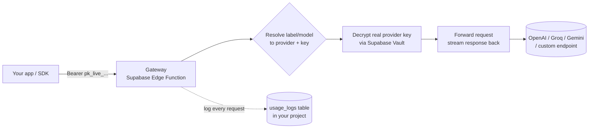
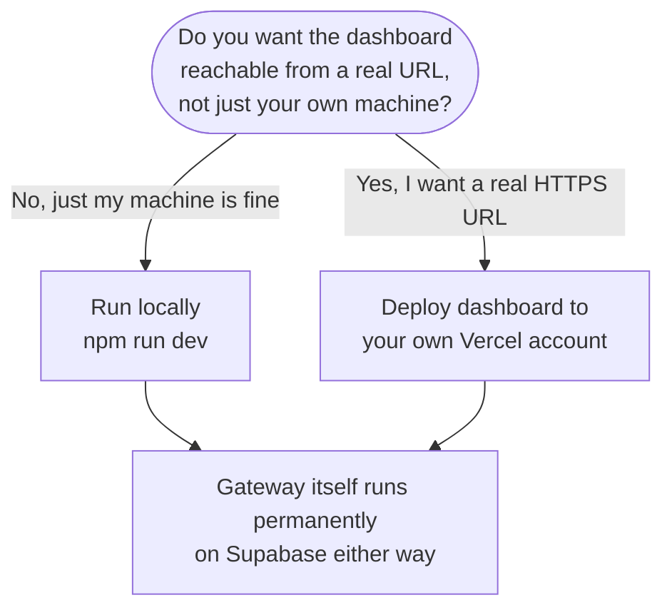
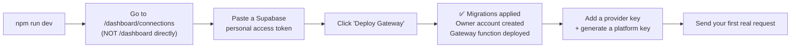

# The Keyroute Project

**One URL. Every AI provider you use. Running entirely inside your own Supabase project — not ours, not anyone's.**

[](LICENSE)
[](https://github.com/basavarajpatil660/the-keyroute-project/stargazers)
[](https://github.com/basavarajpatil660/the-keyroute-project/issues)
[](https://github.com/basavarajpatil660/the-keyroute-project/pulls)

[](https://react.dev)
[](https://www.typescriptlang.org)
[](https://vitejs.dev)
[](https://supabase.com)
[](https://deno.land)
[](https://vercel.com)

Keyroute is a self-hostable AI API gateway. You add the provider keys you already have — OpenAI, Groq, Gemini, or any custom OpenAI-compatible endpoint — give each one a short label, and get back **one URL** that works with any existing OpenAI SDK. Switching providers or rotating a key later means changing one word in your code, not touching your app.

**[Quick start](#quick-start) · [Full setup guide](SETUP.md) · [Why this exists](#why-this-exists) · [Report a bug](https://github.com/basavarajpatil660/the-keyroute-project/issues)**

<p align="center">
  
  <br><em>The homepage</em>
</p>

<p align="center">
  
  <br><em>The dashboard — live usage, latency, and request stats, read straight from your own Supabase project</em>
</p>

---

## Table of contents

- [Why this exists](#why-this-exists)
- [What you get](#what-you-get)
- [How it works](#how-it-works)
- [Deployment options — which one should I pick?](#deployment-options--which-one-should-i-pick)
- [Quick start](#quick-start)
- [Routing convention](#routing-convention)
- [Supported providers](#supported-providers)
- [Security model](#security-model)
- [Limitations & known gaps](#limitations--known-gaps)
- [Tech stack](#tech-stack)
- [FAQ](#faq)
- [License](#license)

---

## Why this exists

This started from a plain annoyance: juggling API keys for OpenAI, Groq, and Gemini across a handful of side projects, hardcoding a different base URL and a different key into every single one. Rotating one key meant hunting down every project that used it. Wanting to try a different provider for one project meant editing code, not flipping a setting.

The obvious fix is some kind of gateway — one URL, one key, route by label. Plenty of hosted "AI gateway" products already do exactly this. The catch: they all want your provider keys sitting on *their* servers. That's a real trust ask for something as sensitive as a billable API key — and it's a single point of failure the moment that company changes pricing, has an outage, or shuts down.

Keyroute removes that trade-off. You get the one-URL convenience, but the entire thing — key storage, encryption, routing, logging — runs inside **your own** Supabase project. Nothing to trust a third party with. Nothing that stops working because someone else's company pivoted. If you can make a free Supabase account, you can run this forever, for free.

Getting the self-host flow down to an actual one-click button (instead of "here are fifteen CLI commands, good luck") turned into its own small project. Supabase's Management API doesn't allow direct browser calls. Function deployment needs real `multipart/form-data`, not JSON. Synthetic auto-created accounts need an email domain that actually passes validation. Row-level security policies and database grants are two separate things that both have to be right, or reads silently fail even with a perfectly valid login session. All of that is already solved and tested in this repo, end to end, on a genuinely fresh Supabase project — so you don't have to rediscover any of it.

---

## What you get

| | |
|---|---|
| 🔗 **One routing convention, any provider** | Prefix a model with your key's label — `openai-work/gpt-4o`, `groq-fast/llama-3.3-70b` — Keyroute resolves it automatically. Only one key configured? Skip the prefix entirely. |
| 🔌 **Drop-in OpenAI compatibility** | Point any existing OpenAI SDK (Python, JS, raw HTTP) at your Keyroute URL, swap in your Keyroute platform key. Everything else — including streaming — stays the same. |
| 🔒 **Your keys never leave your project** | Provider keys are AES-256 encrypted via Supabase Vault before storage. Only a database function inside your own project can decrypt them. |
| 📊 **Real usage visibility** | Every request logs model, token counts, latency, and status — see exactly what you're spending and where. |
| 🕐 **Runs without you** | The gateway is a Supabase Edge Function. It keeps working whether or not your laptop, terminal, or this dashboard are open. |
| 🖱️ **One-click deploy** | No CLI commands required. See [Quick start](#quick-start). |

---

## How it works



The React dashboard in this repo is a **control panel only** — it manages keys and shows usage by talking to the same Supabase project through the normal client library, protected by row-level security. It is never in the path of an actual AI request. The Edge Function handles that directly, independently, permanently.

---

## Keyroute vs. a typical hosted AI gateway

|  | **Typical hosted gateway** | **Keyroute (self-hosted)** |
|---|---|---|
| Where your provider keys live | Their servers | Your own Supabase project |
| Who can see your prompts in transit | Their infrastructure, by design | Nobody — direct pass-through to your provider |
| What happens if they shut down / pivot | Your gateway stops working | Nothing — it's yours, it keeps running |
| Monthly cost | Often a paid tier past a free quota | Free, forever, on Supabase's free tier |
| Setup effort | Sign up, done | One click, ~5 minutes (see below) |
| Data ownership | Shared / theirs | Entirely yours |
| Vendor lock-in | Yes | No — MIT licensed, fork it any time |

This isn't a knock on hosted gateways — they're genuinely faster to try. Keyroute exists for the moment you decide you'd rather not hand a third party your provider keys for anything that matters.

---

## Deployment options — which one should I pick?

You always get the same gateway either way — this choice is only about where the **dashboard** (the control panel) lives.



| | **Local** (`npm run dev`) | **Your own Vercel account** |
|---|---|---|
| Setup time | ~5 minutes | ~10 minutes |
| Reachable from | Only your own machine | Any device, any network |
| Needs your machine running? | Yes, while you're using the dashboard | No — Vercel hosts it |
| Cost | Free | Free (Vercel's free tier) |
| Gateway location either way | Your own Supabase project, always-on | Your own Supabase project, always-on |
| Full guide | [SETUP.md § Part 1](SETUP.md#part-1--run-it-locally) | [SETUP.md § Part 2](SETUP.md#part-2--deploy-the-dashboard-to-your-own-vercel-account) |

You can also do both, pointed at the same Supabase project — there's no conflict.

---

## Quick start

You need one thing: a free [Supabase](https://supabase.com) account.

```bash
git clone https://github.com/basavarajpatil660/the-keyroute-project.git
cd the-keyroute-project
npm install
cp .env.example .env.local
```

Open `.env.local` and fill in `VITE_SUPABASE_URL` and `VITE_SUPABASE_ANON_KEY` — both come from your Supabase project's **Settings → API** page after you create one at [supabase.com/dashboard](https://supabase.com/dashboard).

```bash
npm run dev
```



> ⚠️ **Do not visit `/dashboard` or `/dashboard/overview` first.** On a brand-new install there's no session yet, so those routes immediately redirect you back to setup. Go straight to `/dashboard/connections` — it's the one route designed to work before that session exists, because it's where you create it.

For the fully detailed, screenshot-by-screenshot walkthrough (including generating the access token, what success looks like, and what to do if something goes wrong), see **[SETUP.md](SETUP.md)**.

---

## Routing convention

```http
POST https://<your-project-ref>.supabase.co/functions/v1/gateway
Authorization: Bearer pk_live_...
Content-Type: application/json

{
  "model": "openai-work/gpt-4o",
  "messages": [{ "role": "user", "content": "hello" }],
  "stream": true
}
```

- The part **before** the slash = the label you gave a provider key in the dashboard.
- The part **after** the slash = the model name exactly as that provider expects it.
- Only configured one provider key? Drop the label and slash entirely — just `"model": "gpt-4o"`.

Streaming, non-streaming, and token usage all behave exactly like calling the provider directly — Keyroute is a transparent pass-through, not a re-implementation.

---

## Supported providers

| Provider | Status | Notes |
|---|---|---|
| OpenAI | ✅ Working | |
| Groq | ✅ Working | |
| Gemini | ✅ Working | Via Google's own OpenAI-compatibility layer |
| Custom (any OpenAI-compatible endpoint) | ✅ Working | Set your own base URL when adding the key |
| Anthropic | 🚧 Not yet | Anthropic's message format differs from the OpenAI-compatible shape the gateway currently speaks. Adding an Anthropic key is accepted, but every request against it returns an explicit `501 not_implemented` with a clear message — it never silently fails or pretends to work. |

---

## Security model

- **Encryption at rest** — provider keys go through **Supabase Vault** (AES-256) before they're ever written to a table. The application layer never reads the plaintext key back after you paste it in.
- **Row-level security, correctly enforced** — every user-data table scopes rows with `auth.uid() = user_id`, *and* has the matching table-level `GRANT SELECT` needed to actually make that enforceable through the REST API. (These are two separate requirements in Postgres — a policy with no grant silently blocks everything, which is a real bug this repo hit and fixed.)
- **Least-privilege RPCs** — every mutation (adding a key, rotating it, deleting a connection) goes through a `SECURITY DEFINER` function with explicit grants: `REVOKE ALL FROM PUBLIC` → `REVOKE ALL FROM anon` → `GRANT EXECUTE TO authenticated`, and nothing broader.
- **Zero-persistence access tokens** — the Supabase personal access token used by the one-click Deploy Gateway flow lives only in browser memory for the duration of that one request, then is discarded. It is never written to a database, `localStorage`, `sessionStorage`, or any log, on either the local dev-server proxy or the Vercel-hosted equivalent.

---

## Limitations & known gaps

Being upfront about what this project does **not** do yet:

- **No Anthropic routing yet** — see [Supported providers](#supported-providers) above. Adding a key is safe (you'll get a clear error, not silent failure); actual request routing isn't implemented.
- **Migrations are not re-runnable** — Deploy Gateway can only be run once against a given Supabase project. If it fails partway through, you need a fresh project (or to manually reset the existing one's schema) to retry. This is by design for now, not a planned feature to add idempotency to yet.
- **No built-in rate limiting or spend caps** — Keyroute logs usage so you can *see* what you've spent, but it doesn't currently stop a request before it happens based on a budget you set. Your provider's own dashboard limits are still your real safety net.
- **Single-owner model** — each self-hosted install has exactly one silent "owner" account; there's no multi-user/team support yet.
- **No built-in alerting** — no email/Slack notification when usage spikes or a key nears a limit; you'd need to check the dashboard yourself.

If any of these matter to you, they're reasonable places to contribute — see the [FAQ](#faq) below.

---

## Tech stack

- **Frontend** — React 19, Vite, TypeScript, React Router, TanStack Query
- **Backend** — Supabase (Postgres, Auth, Vault, Edge Functions on Deno)
- **Optional hosting** — Vercel, for the dashboard only. The gateway is Supabase-native regardless of where — or whether — the dashboard is deployed anywhere at all.

---

## FAQ

<details>
<summary><strong>Does this cost anything to run?</strong></summary>
<br>
No, as long as you stay within Supabase's and (optionally) Vercel's free tiers, which are generous enough for personal use. You still pay your AI providers directly for the actual completions — Keyroute doesn't add any markup or fee on top.
</details>

<details>
<summary><strong>Can other people use my instance?</strong></summary>
<br>
That's up to you — it's your Supabase project and your dashboard. By default this repo is set up as a personal, single-owner tool, not a multi-tenant public service.
</details>

<details>
<summary><strong>What happens to my data if I stop using this?</strong></summary>
<br>
Everything lives in your own Supabase project. Delete the project (or just the tables) and every trace of it is gone — there's nothing stored anywhere else, by design.
</details>

<details>
<summary><strong>Why Supabase specifically, and not something else?</strong></summary>
<br>
Supabase bundles Postgres, auth, encrypted secret storage (Vault), and serverless functions (Edge Functions) all in one free-tier project — exactly the set of primitives this needs, without stitching together three or four separate services.
</details>

<details>
<summary><strong>I found a bug / want a feature — where do I go?</strong></summary>
<br>
Open an issue on this repository, or reach out at hello@basavaraj.dev.
</details>


---

## License

MIT — see [LICENSE](LICENSE). Self-host it, fork it, modify it, ship it.
