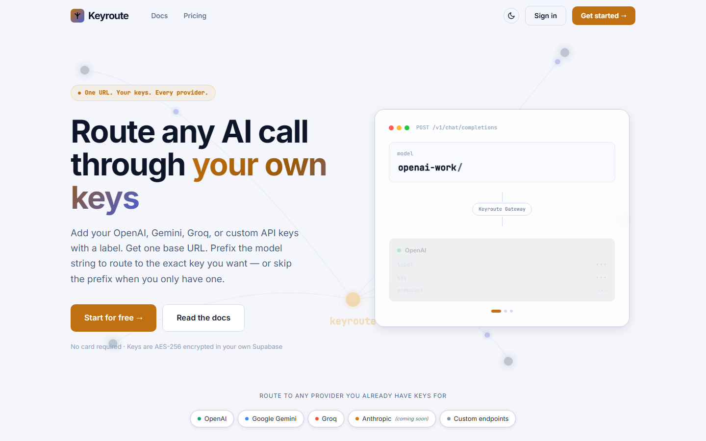

# Keyroute



Keyroute is an OpenAI-compatible AI API gateway: put all of your provider API keys behind a single endpoint and route to any of them just by prefixing the model name. A request for `"openai-work/gpt-4o"` goes to your OpenAI key labelled `openai-work`; `"groq-fast/llama-3.1-8b-instant"` goes to your Groq key — same request shape, one base URL, no SDK changes. Usage per key is logged automatically, and provider keys are encrypted with Supabase Vault, never stored in plaintext. Works with OpenAI, Groq, Gemini's OpenAI-compatible layer, and any custom OpenAI-compatible base URL (Anthropic support is in progress).

## How to use it

Self-hosting is the way Keyroute runs: Deploy Gateway from `/setup` and Keyroute provisions itself into *your own* free Supabase project — schema migrations are applied, the gateway edge function is deployed, and you get your own gateway URL that runs independently of this app forever.

See `/help` and `/docs` on the running app for the full walkthrough — they cover everything in detail and stay up to date with the product, so this README won't duplicate them.

## Quickstart (self-hosted)

```bash
git clone https://github.com/basavarajpatil660/the-keyroute-project.git
cd the-keyroute-project
npm install
cp .env.example .env.local   # fill in VITE_SUPABASE_URL and VITE_SUPABASE_ANON_KEY from your Supabase project
npm run dev
```

Then open `http://localhost:5173/setup`, create a free project at [database.new](https://database.new) if you don't have one, generate a [personal access token](https://supabase.com/dashboard/account/tokens), and click **Deploy Gateway**. That's the whole install.

## Why self-host?

- **Your data stays yours.** Keys, labels, usage logs, and connections live entirely inside your own Supabase project — row-level security scopes every query to your account, and nothing is mirrored anywhere else.
- **The gateway doesn't need you.** Once deployed, the edge function runs permanently in your Supabase project. Close the dashboard, shut down your laptop — client requests still route and log exactly the same.
- **No vendor lock-in.** It's your project, your region, your data. Delete it whenever you like.

## Contributing

Issues and pull requests are welcome — bug reports, self-hosting fixes, and provider integrations (especially Anthropic) are all useful. No formal process yet; just open an issue first for anything large so we can avoid wasted work.

## Credits & license

Built by [Basavaraj M Patil](https://github.com/basavarajpatil660). Released under the [MIT License](LICENSE).
